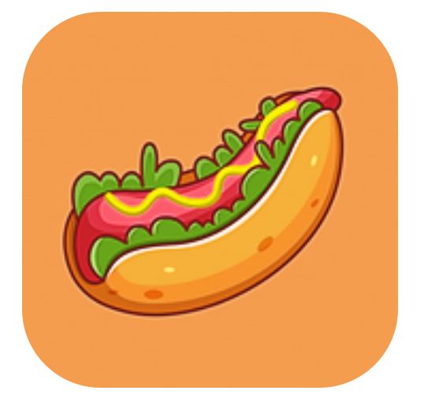
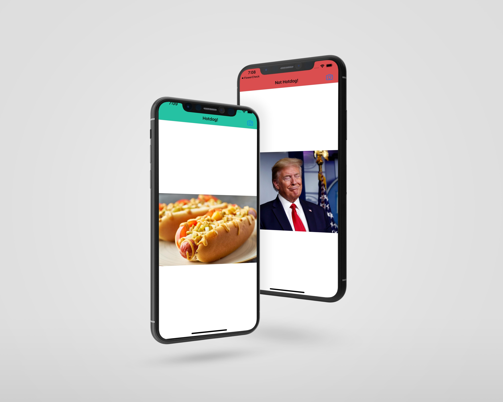

<!-- PROJECT LOGO -->
 

   
  <h2 align="center">SeeFood</h2>

 SeeFood is an app created by Jiang Yang in the season four of Silicon Valley 
 Take a pic of something and it will show you whether the image was classified as a hot dog or as not a hot dog.

 

### Technologies Used

`Swift 5`  `CoreML` 
